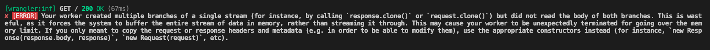

# Next.js' `cachedFetch` response cloning issue

This is a minimal reproduction showing that Next.js' `cachedFetch` function "wasteful" response cloning ([Source code](https://github.com/vercel/next.js/blob/c353b5f0e6a249fcbcf6d073909d203ec7f40768/packages/next/src/compiled/react/cjs/react.react-server.production.js#L127-L131)).

## What the issue is

As you can see from the source code linked above Next.js' `cachedFetch` indiscriminately clones responses so that they can be read multiple times.

This makes sense but it's wasteful as cloning the `response` is actually necessary only when its body is read.

When running such `cachedFetch` inside the Cloudflare workerd runtime indeed you get the following error:


## How to see the error using this reproduction

Install the dependencies:
```sh
$ npm i
```

build the Next.js application for Cloudflare Pages and preview it (using `wrangler`) with:
```sh
$ npm run preview
```

Navigate to the app's home page and you'll be able to see the error in your terminal.

(The error is caused by the home page route making a fetch request twice to the same endpoint, triggering the issue).

## Possible Solutions

Some possible solutions might be:

 - In the `cachedFetch`, instead of indiscriminately cloning responses, a proxy response-like object could be returned instead, that behaves exactly like a web response, but when it's body gets read it clones the response under the hood.

 - In the `cachedFetch` return the response as is without cloning, leaving this task to the developer, they know that `fetch` in Next.js can return the same cached response so based on that knowledge they can manually decide to do the cloning when they know that the same response will be reused.

## Extra

I appreciate that this issue seems only relevant in the Cloudflare workerd runtime, and in a certain sense it is, however the unnecessary cloning and resource wasting is not Cloudflare specific and I'd imagine that it should ideally be avoided.